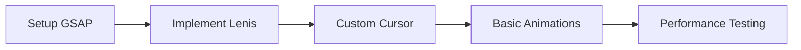
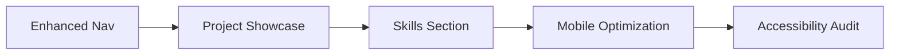
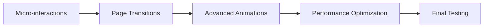

# Software Requirements Specification
## Portfolio Website Enhancement for burakamal.site
### Next.js 15 + React 19 Compatible Implementation

---

## 📋 TABLE OF CONTENTS
1. [Introduction](#1-introduction)
2. [System Overview](#2-system-overview)  
3. [Technical Architecture](#3-technical-architecture)
4. [Feature Requirements](#4-feature-requirements)
5. [Implementation Roadmap](#5-implementation-roadmap)
6. [Performance Requirements](#6-performance-requirements)
7. [Success Metrics](#7-success-metrics)

---

## 1. INTRODUCTION

### 1.1 Purpose
Transform burakamal.site from a solid portfolio into an industry-leading, award-worthy digital experience that rivals portfolios by Bruno Simon, Aristide Benoist, and other creative leaders.

### 1.2 Scope
This SRS outlines a phased enhancement approach that maintains Next.js 15 + React 19 compatibility while implementing cutting-edge interactions, animations, and user experience improvements.

### 1.3 Target Audience
- **Primary**: Frontend developers, creative directors, potential employers
- **Secondary**: Clients, collaborators, industry peers

---

## 2. SYSTEM OVERVIEW

### 2.1 Current State Analysis
✅ **Strengths:**
- Clean, professional design
- Mobile responsive
- Fast loading times
- Modern Next.js architecture

⚠️ **Enhancement Opportunities:**
- Static interactions
- Generic scrolling experience  
- Limited visual hierarchy
- Missing storytelling elements
- No memorable visual moments

### 2.2 Vision Statement
Create a portfolio that tells a compelling story through innovative interactions while maintaining exceptional performance and accessibility standards.

---

## 3. TECHNICAL ARCHITECTURE

### 3.1 Core Technology Stack
```
Frontend Framework: Next.js 15.3.4
React Version: 19.1.0
Styling: TailwindCSS 4.x
Animation Library: GSAP 3.x (React 19 compatible)
Smooth Scrolling: Lenis (latest)
State Management: Zustand (for complex interactions)
```

### 3.2 Architecture Principles
- **Performance First**: Every animation optimized for 60fps
- **Progressive Enhancement**: Core content accessible without JavaScript
- **Mobile-First**: Touch interactions as important as mouse
- **Accessibility**: WCAG 2.1 AA compliance
- **Modularity**: Reusable animation components

### 3.3 File Structure
```
src/
├── components/
│   ├── ui/
│   │   ├── CustomCursor.tsx
│   │   ├── MagneticButton.tsx
│   │   ├── ScrollIndicator.tsx
│   │   └── PageTransition.tsx
│   ├── animations/
│   │   ├── RevealText.tsx
│   │   ├── StaggeredCards.tsx
│   │   └── ParallaxSection.tsx
│   └── sections/
│       ├── HeroEnhanced.tsx
│       ├── ProjectsShowcase.tsx
│       └── InteractiveSkills.tsx
├── hooks/
│   ├── useScrollAnimations.ts
│   ├── useCursorEffects.ts
│   └── usePageTransitions.ts
├── utils/
│   ├── animations.ts
│   └── performance.ts
└── styles/
    └── components.css
```

---

## 4. FEATURE REQUIREMENTS

### 4.1 LEVEL 1: Foundation Enhancements (Week 1-2)

#### 4.1.1 Smooth Scrolling System
**Requirement**: Implement premium smooth scrolling experience
**Technical Approach**:
```typescript
// Enhanced with momentum and custom easing
const scrollConfig = {
  duration: 1.2,
  easing: (t: number) => 1 - Math.pow(1 - t, 3),
  direction: 'vertical',
  smooth: true,
  touchMultiplier: 1.5
}
```

**Success Criteria**:
- Smooth 60fps scrolling on all devices
- Natural momentum feeling
- Responsive to different input methods

#### 4.1.2 Custom Cursor Implementation
**Requirement**: Interactive cursor that enhances user engagement
**Features**:
- State changes based on hover targets
- Smooth magnetic attraction to buttons
- Scale animations for different interactions
- Hidden on touch devices with graceful fallback

#### 4.1.3 Typography Animations  
**Requirement**: Text reveals that create reading rhythm
**Implementation**:
- Staggered character/word reveals
- Scroll-triggered text animations
- Reading-friendly timing (avoid motion sickness)

### 4.2 LEVEL 2: Interactive Elements (Week 3-4)

#### 4.2.1 Enhanced Navigation
**Requirement**: Navigation that guides and delights
**Features**:
- Scroll progress indicator
- Smooth section transitions
- Active section highlighting
- Mobile gesture support

#### 4.2.2 Project Showcase Redesign
**Requirement**: Portfolio pieces that tell their story
**Features**:
- Hover states with project previews
- Smooth transitions between grid/detail views
- Technology stack visualizations
- Performance case studies

#### 4.2.3 Skills Visualization
**Requirement**: Interactive skills presentation
**Implementation**:
- Animated proficiency indicators
- Technology grouping with hover effects
- Timeline of learning progression
- Interactive filtering

### 4.3 LEVEL 3: Advanced Interactions (Week 5-6)

#### 4.3.1 Micro-interactions
**Requirement**: Delightful details that surprise users
**Examples**:
- Button hover states with magnetic effects
- Form input animations
- Loading state animations
- Success/error feedback animations

#### 4.3.2 Scroll-Driven Storytelling
**Requirement**: Content reveals that guide the narrative
**Implementation**:
- Section-based reveals
- Parallax effects for depth
- Scroll-triggered counter animations
- Progressive disclosure of information

---

## 5. IMPLEMENTATION ROADMAP

### Phase 1: Foundation (Week 1-2)


**Deliverables**:
- [ ] GSAP integration with Next.js 15
- [ ] Smooth scrolling implementation
- [ ] Custom cursor component
- [ ] Basic reveal animations
- [ ] Performance baseline measurements

### Phase 2: Interactive Elements (Week 3-4)


**Deliverables**:
- [ ] Redesigned navigation with scroll indicators
- [ ] Interactive project cards
- [ ] Skills visualization component
- [ ] Mobile touch interactions
- [ ] Accessibility compliance check

### Phase 3: Advanced Features (Week 5-6)


**Deliverables**:
- [ ] Comprehensive micro-interaction system
- [ ] Smooth page transitions
- [ ] Advanced scroll-driven animations
- [ ] Performance optimization
- [ ] Cross-browser testing

---

## 6. PERFORMANCE REQUIREMENTS

### 6.1 Core Web Vitals Targets
```
Largest Contentful Paint (LCP): < 1.2s
First Input Delay (FID): < 100ms
Cumulative Layout Shift (CLS): < 0.1
```

### 6.2 Animation Performance
- All animations must run at 60fps
- No main thread blocking > 16ms
- Smooth scrolling on 60Hz and 120Hz displays
- Battery-efficient animations on mobile

### 6.3 Accessibility Standards
- WCAG 2.1 AA compliance
- Keyboard navigation for all interactions
- Screen reader compatibility
- Reduced motion respect (prefers-reduced-motion)

---

## 7. SUCCESS METRICS

### 7.1 Technical Metrics
- [ ] Lighthouse Performance Score: > 95
- [ ] PageSpeed Insights: > 90 (mobile & desktop)
- [ ] First Contentful Paint: < 0.8s
- [ ] Time to Interactive: < 2.0s

### 7.2 User Experience Metrics
- [ ] Bounce Rate: < 30%
- [ ] Average Session Duration: > 2 minutes
- [ ] User Engagement: Heat map analysis
- [ ] Conversion Rate: Contact form submissions

### 7.3 Industry Recognition Targets
- [ ] Awwwards Site of the Day consideration
- [ ] CSS Design Awards recognition
- [ ] FWA (Favourite Website Awards) submission
- [ ] Dribbble/Behance feature potential

---

## 8. RISK MITIGATION

### 8.1 Technical Risks
**Risk**: React 19 compatibility issues with animation libraries
**Mitigation**: Use GSAP as primary animation engine (fully compatible)

**Risk**: Performance degradation with complex animations
**Mitigation**: Implement performance monitoring and lazy loading

**Risk**: Accessibility violations with custom interactions
**Mitigation**: Regular accessibility audits and user testing

### 8.2 Implementation Strategy
1. **MVP First**: Core functionality before enhancements
2. **Progressive Enhancement**: Graceful degradation for older browsers
3. **Performance Budget**: Set and monitor performance limits
4. **User Testing**: Regular feedback loops during development

---

## 9. NEXT STEPS

### Immediate Actions (This Week)
1. **Install Compatible Dependencies**:
   ```bash
   npm install gsap lenis
   ```

2. **Create Base Animation System**:
   - Setup GSAP with Next.js
   - Implement smooth scrolling
   - Create reusable animation hooks

3. **Establish Performance Baseline**:
   - Run Lighthouse audits
   - Measure current animation performance
   - Set monitoring in place

### Success Definition
This enhancement project succeeds when burakamal.site becomes a memorable experience that:
- Tells Burak's professional story compellingly
- Demonstrates technical expertise through implementation
- Loads fast and performs smoothly on all devices
- Inspires other developers and potential collaborators
- Generates meaningful professional opportunities

---

*This SRS represents a comprehensive roadmap for creating an industry-leading portfolio experience while maintaining technical excellence and accessibility standards.*
